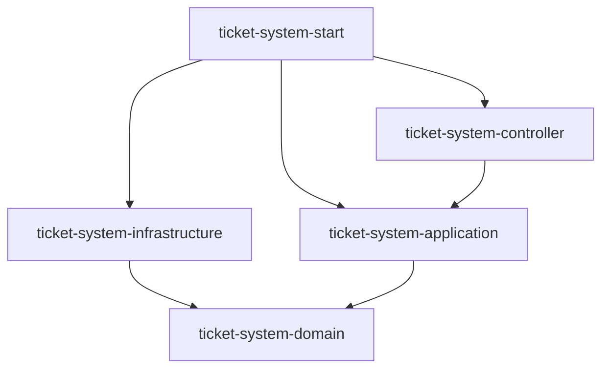

# Kiến Trúc Dự Án (DDD Architecture)

Dự án này được xây dựng dựa trên nguyên lý **Domain-Driven Design (DDD)** và **Clean Architecture**. Mục tiêu là tách biệt logic nghiệp vụ khỏi các chi tiết kỹ thuật.

## Sơ đồ phụ thuộc (Dependency Diagram)

---

## 1. Ý nghĩa từng Module

### 🛡️ `ticket-system-domain` (Lớp Lõi - Core)
- **Nhiệm vụ:** Chứa các nghiệp vụ cốt lõi (Entities, Value Objects, Repository Interfaces). Đây là nơi định nghĩa "Luật chơi" của hệ thống.
- **Đặc điểm:** **Độc lập hoàn toàn**. Không phụ thuộc vào bất kỳ module nào khác, không biết về database hay framework.

### ⚙️ `ticket-system-application` (Lớp Ứng dụng)
- **Nhiệm vụ:** Điều phối (Orchestrator). Chứa các **App Service** để thực hiện các Use Case. Nó nhận request, phối hợp với Domain để xử lý và Infrastructure để lưu trữ.
- **Phụ thuộc:** `domain`.

### 🔌 `ticket-system-infrastructure` (Lớp Hạ tầng)
- **Nhiệm vụ:** Triển khai kỹ thuật chi tiết. Ví dụ: Cấu hình JPA/Hibernate (Database), Kafka (BrokerMQ), Email Service.
- **Phụ thuộc:** `domain` (để thực thi các interface repository đã định nghĩa ở domain).

### 🌐 `ticket-system-controller` (Lớp Giao diện/API)
- **Nhiệm vụ:** Tiếp nhận yêu cầu HTTP (REST API), trả về kết quả cho người dùng.
- **Phụ thuộc:** `application` (để gọi xuống các service xử lý use case).

### 🚀 `ticket-system-start` (Module Khởi chạy)
- **Nhiệm vụ:** Điểm khởi đầu của Spring Boot. Gom tất cả các module lại thành một ứng dụng hoàn chỉnh và chứa cấu hình `application.yml`.
- **Phụ thuộc:** Tất cả các module (`controller`, `application`, `infrastructure`).

---

## 2. Tại sao lại phụ thuộc lẫn nhau như vậy?

Mô hình này tuân thủ luồng phụ thuộc **hướng vào trung tâm (Inwards)**:
`Start -> Controller -> Application -> Domain`

1.  **Dễ bảo trì:** Logic nghiệp vụ (`domain`) được bảo vệ. Bạn có thể thay đổi Database (sửa `infrastructure`) mà không cần đụng vào code nghiệp vụ.
2.  **Dễ kiểm thử (Testing):** Có thể viết Unit Test cho `domain` một cách dễ dàng vì nó không dính líu đến framework hay database.
3.  **Linh hoạt:** Nếu trong tương lai bạn muốn thay đổi từ REST sang GraphQL, bạn chỉ cần tạo module controller mới mà không ảnh hưởng đến phần còn lại.
