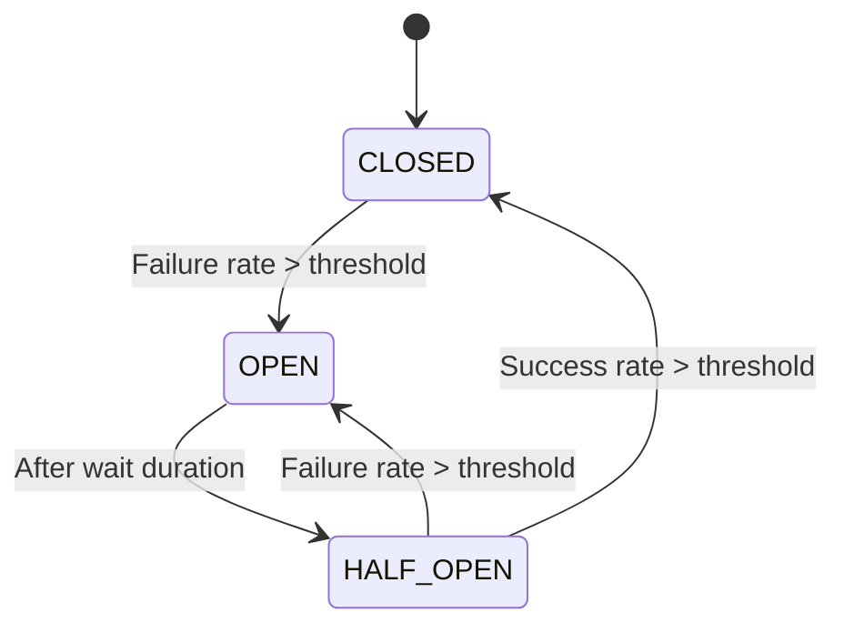
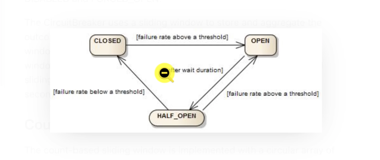

# Hướng Dẫn Cơ Chế Resilience4j

Tài liệu này giải thích các cơ chế tự phục hồi (Resilience) được cấu hình trong dự án bằng Resilience4j.

## 1. Circuit Breaker (Bộ ngắt mạch)

Cơ chế này hoạt động dựa trên sơ đồ trạng thái giúp bảo vệ hệ thống khỏi sự cố dây chuyền.

### Sơ đồ trạng thái

### Các trạng thái:
- **CLOSED (Đóng)**: Hệ thống hoạt động bình thường, mọi request được cho phép đi qua. CB theo dõi tỉ lệ lỗi.
- **OPEN (Mở - Ngắt mạch)**: Mạch bị ngắt do lỗi vượt ngưỡng. Mọi request bị chặn ngay lập tức (Fail-fast) để dịch vụ hồi phục.
- **HALF_OPEN (Mở một nửa)**: Trạng thái thử nghiệm. CB cho phép một vài request đi qua để kiểm tra dịch vụ đã ổn định chưa.

---

## 2. Rate Limiter (Giới hạn lưu lượng)

Giới hạn số lượng request trong một khoảng thời gian nhất định để tránh quá tải hệ thống hoặc bị tấn công DOS.

- **`limitForPeriod`**: Số lượng request tối đa được phép trong một chu kỳ.
- **`limitRefreshPeriod`**: Khoảng thời gian để làm mới (reset) lại số lượng request.
- **`timeoutDuration`**: Thời gian request phải đợi nếu đã hết lượt (0 = báo lỗi ngay).

---

## 3. Retry (Cơ chế thử lại)

Tự động thực hiện lại request khi gặp lỗi tạm thời (như mạng chập chờn).

- **`maxAttempts`**: Tổng số lần thử lại tối đa.
- **`exponentialBackoff`**: Cơ chế tăng dần thời gian chờ giữa các lần thử để tránh gây áp lực dồn dập cho dịch vụ đang lỗi.

---

## 4. Bulkhead (Vách ngăn tài nguyên)

Giới hạn số lượng luồng dữ liệu (threads) xử lý đồng thời cho một dịch vụ nhất định.

- **Nhiệm vụ**: Đảm bảo lỗi ở một endpoint không làm treo toàn bộ server do chiếm hết tất cả các thread của hệ thống.

---

## 5. Theo dõi qua Spring Boot Actuator

Sau khi cấu hình `management.endpoints.web.exposure.include: "*"`, bạn có thể theo dõi trạng thái các cơ chế tại:

- **Health Check**: `http://localhost:8080/actuator/health` (Xem trạng thái OPEN/CLOSED của CB).
- **Danh sách CB**: `http://localhost:8080/actuator/circuitbreakers`
- **Lịch sử sự kiện**: `http://localhost:8080/actuator/circuitbreakerevents`
- **Danh sách Rate Limiters**: `http://localhost:8080/actuator/ratelimiters`

---

## Tóm tắt các thông số trong `application.yml`

| Cơ chế | Thuộc tính quan trọng | Ý nghĩa |
| :--- | :--- | :--- |
| **CircuitBreaker** | `failureRateThreshold` | Ngưỡng % lỗi để ngắt mạch. |
| **CircuitBreaker** | `waitDurationInOpenState` | Thời gian nghỉ khi mạch đang ngắt. |
| **RateLimiter** | `limitForPeriod` | Số lượt truy cập tối đa mỗi chu kỳ. |
| **Retry** | `maxAttempts` | Số lần gọi lại tối đa nếu thất bại. |
| **Bulkhead** | `maxConcurrentCalls` | Số luồng xử lý đồng thời tối đa. |

